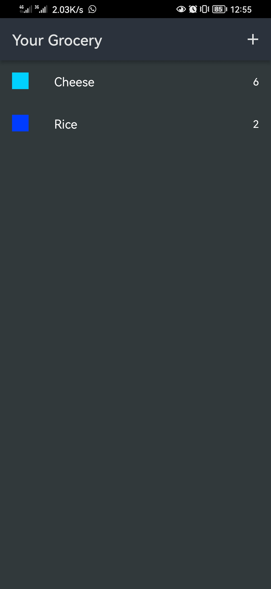
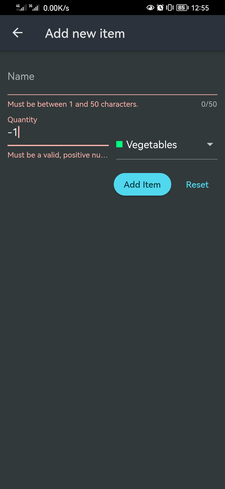
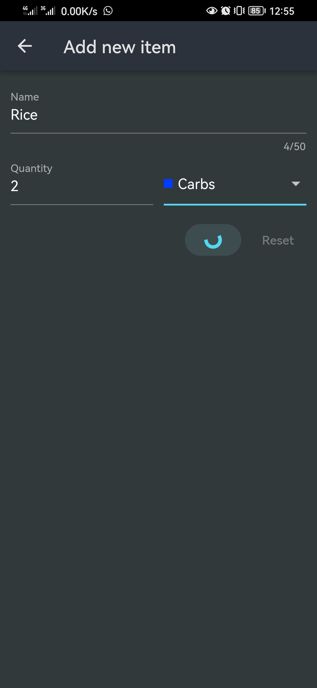

# 🛒 Shopping Cart App

A minimal Flutter app to manage your shopping list using Firebase.  
You can add items with a name, quantity, and category — and view them in a neat list.

## 🚀 Features

- Add items with a name, quantity, and dropdown category
- Simple home screen to view your cart
- Firebase Firestore integration for real-time data
- Clean and responsive UI

## 📸 Screenshots

  
  
  

## 🔧 Tech Used

- Flutter
- Firebase (Firestore)

## 📝 Notes

This is a simple app made to practice Flutter with Firebase — no state management or advanced architecture, just pure basics.

